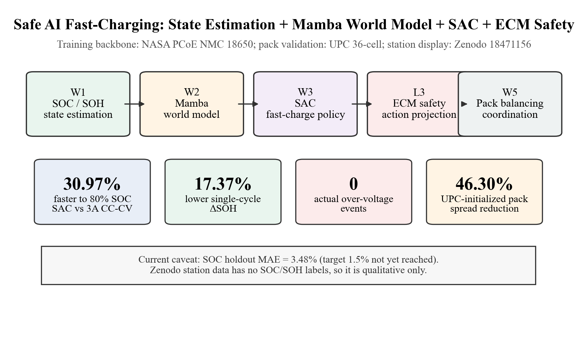
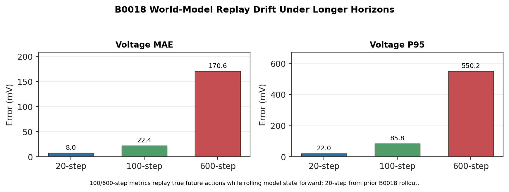
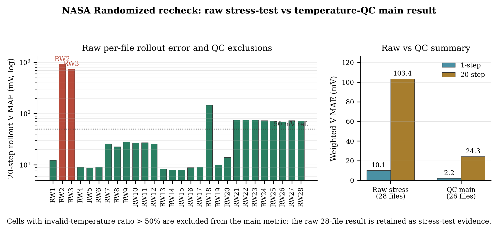
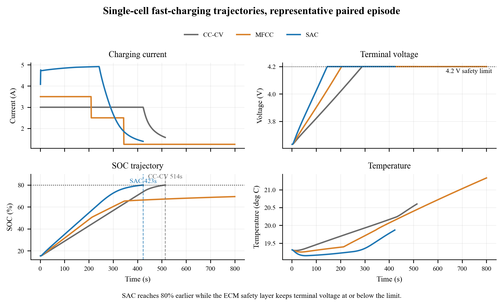
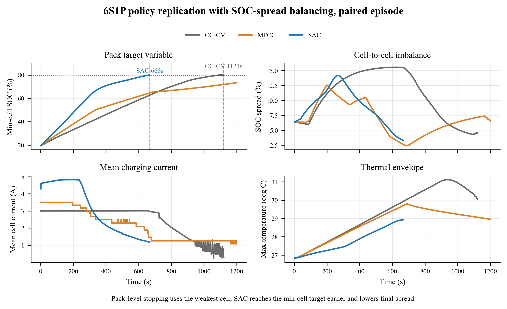

# CRAIC2026 项目证明材料（精简版）

项目：Mamba 世界模型 + SAC 强化学习 + ECM 物理安全层的 EV 智能快充决策系统
仓库：<https://github.com/Travor278/SOHC>  
日期：2026-05-10

> 本版只保留两类内容：**图片证据（配简短解释）** 和 **关键伪代码（配简短解释）**。长篇背景、论文式叙述和大段实现细节见 [CRAIC2026_REPORT_DRAFT.md](CRAIC2026_REPORT_DRAFT.md)。

## 1. 图片证据

### 图 0 系统与结果总览



解释：该图给出完整证据链：W1 状态估计、W2 世界模型、W3 SAC 策略、W4 单体评估、W5 多单体/真实 pack 展示；同时标出 SOC、老化头和真实电站标签仍是边界。

### 图 1 三层智能快充架构


解释：系统由状态估计层、Mamba 世界模型、SAC 策略层、ECM 安全层组成；ECM 在动作执行前做硬安全投影。

### 图 2 数据来源与用途


解释：训练主线只使用 NASA PCoE 同源 NMC 18650 数据；LG 只提供 SOC warm-start 权重，UPC/Zenodo 只用于展示和边界诊断。

### 图 3 SOC 估计结果


解释：W1 LSTM 在 B0018 holdout 上 MAE 为 `3.48%`，能作为后续世界模型/RL 的软标签工程基线，但尚未达到 `<1.5%`。

### 图 4 SOH 估计结果


解释：SOH baseline 可跟随 NASA 容量退化趋势；但该结果依赖 `Capacity` 字段，是软标签/一致性基准，不是无容量标签部署模型。

### 图 5 Mamba 世界模型短期预测


解释：B0018 1-step V MAE 为 `1.42 mV`，20-step V MAE 为 `8.04 mV`，说明短期 rolling dynamics 可用于 W3/W4 策略环境。

### 图 6 长 horizon replay 漂移



解释：100-step V MAE 为 `22.36 mV`，600-step V MAE 为 `170.56 mV`；因此世界模型不能被表述为真实电池 plant 的 600-step 长开环替代。

### 图 7 Randomized 动态负载复核



解释：Randomized raw 28-file 暴露异常温度文件和动态负载边界；温度 QC 后 26/28 文件 one-step V MAE 为 `2.17 mV`，20-step V MAE 为 `24.29 mV`。

### 图 8 ECM 安全动作投影


解释：ECM 安全层可将潜在越压动作投影到安全电流区间；随机 1000 条动作投影均满足电压边界。

### 图 9 单体核心指标对比


解释：在 paired episodes 上，SAC 相比 3A CC-CV 充电时间缩短 `30.97%`，代理 ΔSOH 降低 `17.37%`，实际过压为 `0`。

### 图 10 单体充电轨迹



解释：SAC 形成动态电流曲线，而不是简单恒流拉高；电压轨迹由 ECM 安全层约束在安全范围内。

### 图 11 多单体策略复制



解释：该图证明单体策略可以复制到 independent-cell supervisory prototype，并用 SOC-spread 协调降低不一致性；它不是串联包 KCL/KVL 电路仿真。

### 图 12 主动均衡拓扑示意


解释：图中表达的是 supervisory active buck-boost balancing law，不声称已经完成 MOSFET/PWM 开关级仿真。

### 图 13 UPC 真实 pack 工况


解释：UPC 真实 12S3P pack 数据显示动态工况下 cell voltage spread 可达数百 mV，说明包级均衡问题真实存在。

### 图 14 UPC 高 spread 短仿真


解释：在相同 UPC 高 spread 初值下，active balancing 将 spread 从 `622.00 mV` 降至 `334.00 mV`，降幅 `46.30%`。

### 图 15 Zenodo 6985321 zero-shot 诊断


解释：fresh/aged SOC MAE 分别为 `16.11%` / `14.03%`，说明跨尺度 SOC zero-shot 尚不可靠；半循环 throughput SOH 可区分 fresh/aged。

### 图 16 真实电站定性展示


解释：该图证明真实电站 CSV 接口可跑通；因数据无 SOC/SOH/容量标签，只作定性展示，不作定量精度结论。

## 2. 关键伪代码

### 伪代码 1：SOC 严格标签与 LSTM fine-tune

```text
Input:
    NASA cycle data: V, I, T, t, Capacity
    KeiLongW pretrained LSTM weights

For each discharge cycle:
    sort samples by time
    throughput = integrate_discharge_current(I, t)
    SOC_start = 1.0
    SOC_end = calibrated_by_capacity_and_cutoff
    SOC_label = map_throughput_to_SOC(SOC_start, SOC_end)
    reject windows crossing cycle boundary

Build windows:
    X = sliding_window([V, I, T], length=L)
    y = SOC_label_at_window_end

Train:
    load KeiLongW weights
    freeze first two LSTM layers
    train last LSTM + dense head
    select best checkpoint by B0018 holdout MAE

Output:
    outputs/soc_finetuned.h5
```

解释：SOC 模型复用 KeiLongW 的 LSTM 结构和 LG 预训练权重，但正式训练/验证回到 NASA 同源数据。

### 伪代码 2：SOH capacity-ratio baseline

```text
Input:
    NASA cycle data with Capacity

For each cell:
    fresh_capacity = first_valid_capacity
    For each cycle:
        SOH = Capacity / fresh_capacity
        features = [
            mean/std/min/max(V),
            mean(I), mean(abs(I)),
            mean/max(T),
            cycle_duration,
            capacity_consistency_terms
        ]

Fit lightweight Ridge / variance-style baseline
Evaluate on held-out cell

Output:
    outputs/soh_baseline.pt
```

解释：SOH baseline 用于容量退化一致性验证和软标签，不代表无容量标签在线 SOH 部署能力。

### 伪代码 3：Residual Mamba 世界模型

```text
Input sequence:
    X[t-L:t] = [SOC, SOH, V, I, T, action_current]

Target:
    y = [SOC_next, V_next, T_next, delta_SOH]

Model:
    z = input_projection(X)
    z = Mamba_blocks(z)        # or GRU fallback
    h = last_token(z)
    residual = dense_head(h)

Prediction:
    SOC_next = SOC_last + residual_SOC
    V_next   = V_last   + residual_V
    T_next   = T_last   + residual_T
    delta_SOH = positive_part(residual_SOH)

Train:
    minimize MSE(prediction, target)
    validate 1-step, 20-step, 100-step, 600-step replay
```

解释：Residual head 让初始行为接近 persistence baseline；当前模型短期有效，但 600-step replay 漂移大。

### 伪代码 4：SOH-aware ECM 安全投影

```text
Input:
    SOC, SOH, requested_current
    ECM params: R0, R1, R2, C1, C2, OCV(SOC)

Convert current sign to ECM convention

R0_eff = R0 * (2 - clip(SOH, 0.5, 1.0))

Predict:
    V1_next = RC_update(V1, current, R1, C1)
    V2_next = RC_update(V2, current, R2, C2)
    V_pred = OCV(SOC) - current * R0_eff - V1_next - V2_next

If V_pred > V_max:
    current = solve_current_at_voltage(V_max)
Else if V_pred < V_min:
    current = solve_current_at_voltage(V_min)
Else:
    keep current

Update ECM polarization states
Return safe_current
```

解释：ECM 层是硬安全约束；SOH 越低，等效 R0 越高，投影越保守。

### 伪代码 5：SAC 环境一步更新

```text
Input:
    observation = [SOC, SOH, V, I, T]
    action_norm in [-1, 1]

requested_current = scale(action_norm, 0, I_max)
safe_current = ECM_Project(SOC, SOH, requested_current)

pred = MambaWorldModel(history, safe_current)

model_delta_soh = max(pred.delta_SOH, 0)
aging_proxy_delta_soh = stress_proxy(
    current=safe_current,
    raw_voltage=pred.raw_voltage,
    temperature=pred.temperature
)

delta_soh = max(model_delta_soh, aging_proxy_delta_soh)

next_state = [
    clip(pred.SOC_next),
    SOH - delta_soh,
    clip(pred.V_next, V_min, V_max),
    safe_current,
    pred.T_next
]

reward =
    30  * delta_SOC
    -300 * voltage_risk(raw_voltage)
    -0.02 * temperature_risk(T)
    -120 * delta_soh
```

解释：当前评估中 `model_delta_soh` 总和为 0，ΔSOH 改善主要来自物理应力 proxy，而不是 Mamba 老化头。

### 伪代码 6：CC-CV / MFCC / SAC paired evaluation

```text
For each random seed:
    initialize identical battery state

    For strategy in [CC-CV, MFCC, SAC]:
        rollout until:
            SOC >= 0.8
            or voltage/temperature unsafe
            or horizon reached

        log per-step:
            SOC, SOH, V, I, T
            model_delta_soh
            aging_proxy_delta_soh
            overvoltage flag

Select paired episodes:
    keep episodes where both CC-CV and SAC reach 80% SOC

Report:
    time_to_80
    delta_SOH
    overvoltage_count
    improvement_vs_CC-CV
```

解释：核心百分比只在 paired episodes 上计算，避免把未达到 80% 的 baseline 样本用于速度比较。

### 伪代码 7：多单体 supervisory strategy replication

```text
Initialize N independent cell environments

For each time step:
    For each cell i:
        base_current[i] = strategy(cell_state[i])

    mean_soc = mean(SOC[1:N])

    For each cell i:
        trim[i] = gain * (mean_soc - SOC[i])
        trim[i] = clip(trim[i], -max_balance_current, max_balance_current)
        current[i] = clip(base_current[i] + trim[i], 0, I_max)

    Step each independent cell with current[i]

Stop when:
    min(SOC) >= 0.8
    or safety/horizon condition is met

Output:
    per-cell trajectories
    SOC spread
    delta_SOH
```

解释：该算法证明多单体策略复制和 SOC-spread 协调逻辑，不证明真实串联包电路级均衡。

### 伪代码 8：UPC pack spread 分析与短仿真

```text
Load UPC parquet cycle

Extract:
    cell_voltage[time, 36]
    branch_current[time, 3]
    temperature[time, 36]
    BMS_SOC[time]

Compute:
    voltage_spread = max(cell_voltage) - min(cell_voltage)
    spread_mean
    spread_p95
    spread_max

Select high-spread initial condition

Case A:
    balancing_current = 0
    simulate spread evolution

Case B:
    active_balancing_current = controller(voltage_spread, SOC_spread)
    simulate spread evolution

Compare:
    final_spread
    spread_reduction
    max_balance_current
```

解释：UPC 提供真实 pack 不一致性证据；Python 短仿真只证明 supervisory law 有潜力，仍需 Simulink/Simscape 验证电路约束。

## 3. 最短答辩口径

```text
1. 数据可信：NASA 同源 NMC 18650 主线，避免跨化学体系混训。
2. 状态估计可跑：SOC B0018 MAE 3.48%，SOH 容量比一致性可用。
3. 世界模型短期有效：1-step 1.42 mV，20-step 8.04 mV；600-step 漂移已主动报告。
4. 安全层有效：ECM 投影 1000 随机动作全部满足电压边界。
5. 策略有效：SAC vs CC-CV，时间 -30.97%，代理 ΔSOH -17.37%，过压 0。
6. 包级扩展谨慎：多单体 supervisory prototype + UPC 真实 pack 数据，不冒充真实串联包仿真。
```
