# 面向电动汽车智能快充的 Mamba 世界模型、SAC 强化学习与 ECM 物理安全层协同决策系统

版本：v0.2 报告草稿（已插入 IEEE 风格插图）
日期：2026-05-08  
代码仓库：<https://github.com/Travor278/SOHC>

> 写作状态说明：本文按当前工程状态撰写，可作为本科生 AI 创新赛报告 / 论文初稿。文中结果仅使用已经跑通或已经生成的本地实验产物。SOC `<1.5%` 和 BatteryML Mamba-head SOH 对比仍未完成；Zenodo 6985321 / 18471156 已补充为泛化展示，但仅作跨数据集诊断与定性展示，不作为 NASA 主线定量验收。

## 摘要

电动汽车快充场景需要在充电速度、电池安全边界和老化损耗之间进行实时折中。传统 CC-CV 充电策略规则简单、工程成熟，但难以根据电池状态、温度、健康度与动态负载历史进行自适应优化。本文构建了一套面向 EV 智能快充决策的三层 AI 控制架构：第一层使用状态估计器提供 SOC/SOH 软标签，第二层使用 Mamba 世界模型学习电池状态转移，第三层使用二阶 ECM 物理安全层对强化学习动作进行硬约束投影。在策略层，本文采用 Soft Actor-Critic（SAC）训练连续电流控制策略，并在奖励函数中显式加入电压风险、温度风险和 SOH 损耗惩罚。

实验主线采用 NASA PCoE 同源 NMC 18650 数据，包含 B0005/B0006/B0007/B0018 主集、ARC-FY08Q4 多温度多倍率子集和 Randomized Battery Usage 动态负载子集。当前系统已完成 W0-W4 主链路：SOC 推断链路可运行，B0018 holdout MAE 为 3.48%；SOH 容量比基线在 NASA holdout 上满足 2% RMSE 阈值；Mamba 世界模型在 B0018 holdout 上实现 1-step 电压 MAE 1.42 mV、20-step rollout 电压 MAE 8.04 mV；ECM 安全层在随机动作投影测试中 100% 满足电压边界。端到端快充评估表明，在同初始条件且双方均充至 80% SOC 的 paired episodes 上，SAC 相比 3A CC-CV 将充电时间由 596.5 s 降至 411.75 s，速度提升 30.97%；单循环 ΔSOH 由 0.001859 降至 0.001536，下降 17.37%；实际过压次数为 0。

进一步地，本文将单体策略复制到 6S1P / 30S1P 包级原型，并引入 SOC-spread 主动均衡协调器。在 6S1P paired episode 中，SAC 相比 CC-CV 将 pack min-cell 到 80% 的时间从 1121 s 降至 668 s，平均 ΔSOH 降低 23.01%，末端 SOC spread 降低 28.00%。为避免使用来源不明的 Simulink 资产作为定量依据，本文还引入 UPC 36-cell pack WLTP+CC-CV 真实数据集进行包级不一致性分析与主动均衡短仿真。基于真实 UPC 高 spread 初值，Python active buck-boost 数字孪生在 30 min 内将 cell voltage spread 从 622.00 mV 降至 334.00 mV，降幅 46.30%。这些结果表明，本文提出的“世界模型 + 强化学习 + 物理安全层”框架能够在单体快充闭环中兼顾速度、安全与老化，并具备向包级均衡协调扩展的可行性。

关键词：电动汽车快充；电池管理系统；Mamba 世界模型；SAC 强化学习；SOC/SOH 估计；ECM 安全层；主动均衡

## 1. 引言

动力电池快充策略直接影响电动汽车补能体验与电池寿命。实际充电过程中，电池端电压、温度、内阻、SOC 与 SOH 均随时间变化，且不同单体之间存在制造差异和老化差异。若仅依赖固定电流阈值或静态充电规则，策略通常需要保守留出安全裕度，从而牺牲充电速度；若单纯追求高电流快充，又可能造成过压、过热或加速容量衰减。

传统 CC-CV 策略以恒流阶段快速提升 SOC，再在接近电压上限时转入恒压阶段，具有实现简单和安全性高的优点。然而该策略没有显式利用历史状态序列，也难以将老化损耗纳入优化目标。近年来，深度学习序列模型、强化学习和物理约束控制逐渐被用于电池管理系统。序列模型可从电压、电流、温度历史中学习状态演化；强化学习可在连续动作空间中优化动态充电电流；物理模型则可提供可解释的安全边界。

本文的目标不是替代已有 BMS 安全机制，而是在保留物理硬约束的前提下，用 AI 决策层生成更高效、更温和的快充电流轨迹。核心思路是：用 SOC/SOH 估计器把传感器序列转成状态变量，用 Mamba 世界模型构建可训练的电池动力学环境，用 SAC 学习快充策略，并用 ECM 安全层对每一步电流动作进行投影，保证端电压不越界。

## 2. 总体架构与数据策略

### 2.1 三层决策架构

本文系统由状态估计层、世界模型层、策略优化层和物理安全层组成。整体数据流如下：

```text
NASA PCoE / ARC / Randomized
        │
        ▼
SOC/SOH 估计器
        │  [SOC, SOH, V, I, T]
        ▼
Mamba 世界模型
        │  预测 [SOC_next, V_next, T_next, ΔSOH]
        ▼
SAC 强化学习策略
        │  输出候选充电电流 action
        ▼
ECM 物理安全层
        │  投影为 safe_current
        ▼
安全快充轨迹与包级均衡协调
```

其中，Mamba 世界模型负责学习状态转移，SAC 负责在连续动作空间中搜索最优充电电流，ECM 安全层负责把候选动作投影到满足电压约束的安全动作集合。这样的设计将数据驱动模型的适应性与物理模型的安全性结合起来。

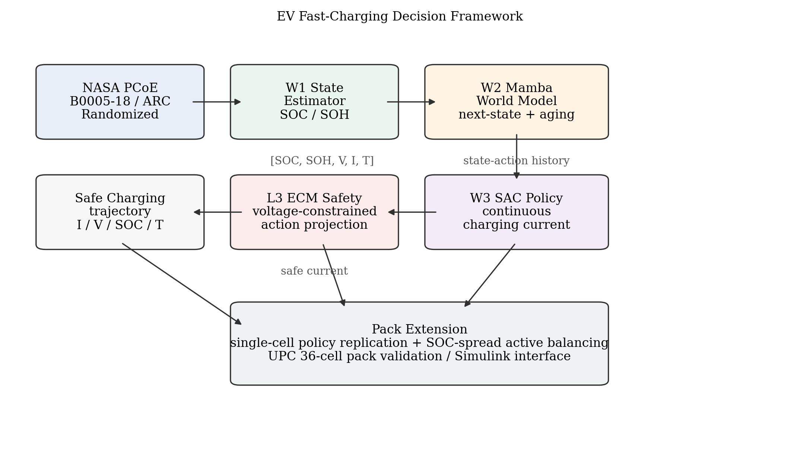

图 1 给出了本文系统总览：状态估计层提供 SOC/SOH，Mamba 世界模型学习状态转移，SAC 输出连续充电电流，ECM 安全层在动作执行前进行电压约束投影，最终扩展到多单体包级均衡协调。

### 2.2 数据策略

本文训练主线采用 NASA PCoE 同源 NMC 18650 数据，避免跨化学体系迁移带来的不可控误差。使用的数据子集包括：

| 数据子集 | 用途 | 说明 |
|---|---|---|
| NASA B0005/B0006/B0007/B0018 | SOH、世界模型主训练、holdout 验证 | 经典 NMC 18650 容量退化数据 |
| NASA ARC-FY08Q4 | SOC fine-tune | 多温度、多倍率运行条件 |
| NASA Randomized Battery Usage | 世界模型动态负载外推 | 随机电流 profile，筛除电流剧烈跳变段 |
| LG 18650HG2 | SOC warm-start 权重来源 | 仅使用 KeiLongW 预训练权重，不进入训练主线 |
| UPC 36-cell pack WLTP+CC-CV | 包级扩展验证 | 真实 12S3P pack 数据，含 36 cell 电压与 3 支路电流 |
| Zenodo 6985321 | 跨数据集 zero-shot 诊断 | fresh/aged cell、OCV-SOC 表、WLTP 片段，不进入训练 |
| Zenodo 18471156 | 真实储能电站定性展示 | 多 cell 电压/温度/电流监测，无 SOC/SOH 标签 |

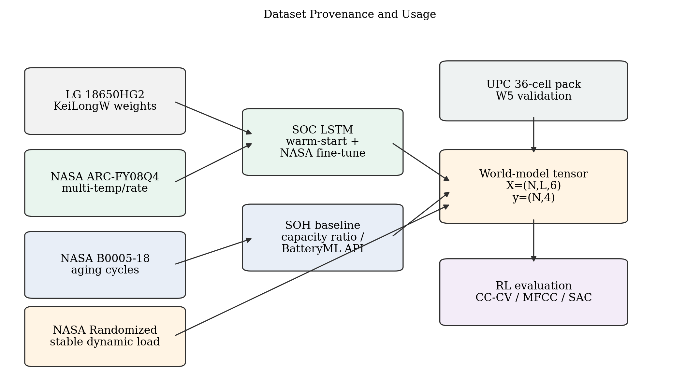

HUST 数据保留为可选展示，不进入当前训练管线。Zenodo 6985321 和 Zenodo 18471156 均不参与训练；前者用于 zero-shot 误差诊断，后者只用于真实电站时序的定性展示。

## 3. 方法

### 3.1 SOC 估计器

SOC 估计器采用 KeiLongW 风格的 stacked LSTM 网络。输入为固定长度滑动窗口内的电压、电流和温度序列：

```text
X_soc ∈ R^(N × L × 3),  channel = [V, I, T]
```

网络结构如下：

```text
LSTM(256, selu, return_sequences=True)
LSTM(256, selu, return_sequences=True)
LSTM(128, selu)
Dense(64, selu)
Dense(1)
```

训练采用 warm-start 策略：首先加载 KeiLongW release 中的 LG 18650HG2 `.h5` 权重，然后在 NASA 数据上 fine-tune。为降低跨 cycle 标签污染，本文重新构造了严格 SOC 标签：每个 discharge cycle 独立积分，起点强制 SOC=1，终点按容量和截止点校准，并禁止滑动窗口跨 cycle。当前最优设置为 B0005/B0006/B0007 训练，B0018 holdout，SOC MAE 为 3.48%。

### 3.2 SOH 估计器

SOH 估计器使用 BatteryML-compatible 数据接口，将 NASA loader 输出转为 cycle-level 样本。SOH 标签由容量比构造：

```text
SOH = capacity / fresh_capacity
```

特征包括电压均值、标准差、最大/最小值，电流均值、绝对电流均值，温度均值、最大值，cycle 时长和容量一致性特征。当前 Ridge / Variance-style baseline 在 NASA holdout 上 RMSE 满足 2% SOH 阈值。需要强调的是，该 baseline 依赖 NASA `Capacity` 字段，适合当前软标签和一致性验证，不等价于部署时完全无容量标签的 SOH 估计器。

### 3.3 Mamba 世界模型

世界模型用于学习电池状态在给定动作下的一步转移。输入为长度 `L=64` 的历史状态-动作序列：

```text
X_world[t-L:t] = [SOC, SOH, V, I, T, action_current]
```

输出为下一步状态和老化损耗：

```text
y_hat = [SOC_next, V_next, T_next, delta_SOH]
```

当前实现采用 residual head：

```text
SOC_next = SOC_last + ΔSOC
V_next   = V_last   + ΔV
T_next   = T_last   + ΔT
```

这种设计使模型初始行为接近 persistence baseline，有利于降低电压预测漂移。模型后端优先使用 `mamba-ssm`；在 Windows/CUDA 不可用时保留 GRU fallback。最终世界模型在 WSL GPU 上以 Mamba 后端训练完成。

### 3.4 ECM 物理安全层

ECM 安全层基于 legacy MATLAB STA / MIUKF 资产中的二阶 RC 参数重写。强化学习策略输出候选充电电流后，ECM 安全层预测端电压，并将动作投影到满足约束的安全区间：

```text
V_min <= V_pred <= V_max
```

本项目约定 RL / 世界模型口径为正电流表示充电，而 legacy MATLAB ECM 参数更接近正电流表示放电，因此传入 ECM 前进行电流符号适配。ECM 层在 W3/W4 中作为硬安全约束使用，同时世界模型 raw voltage 仍进入 reward 的电压风险项，避免策略只依赖裁剪后的安全观察值。

### 3.5 SAC 快充策略

策略层使用 Soft Actor-Critic（SAC）进行连续动作控制。动作空间为充电电流，观测包含 SOC、SOH、电压、电流、温度与历史窗口。奖励函数由四部分构成：

```text
r_t = w_speed · ΔSOC
      - w_voltage · voltage_risk(V_raw)
      - w_temperature · temperature_risk(T)
      - w_aging · aging_cost(ΔSOH, I, V, T)
```

最终采用的核心权重为：

```text
speed = 30
voltage = 300
temperature = 0.02
aging = 120
```

训练参数为 `total_steps=60000`、`max_steps=600`、`buffer_size=20000`、`batch_size=64`。训练后策略保存为 `outputs/sac_policy.zip`。

### 3.6 包级策略复制与主动均衡

在包级扩展中，本文先不直接求解开关级 buck-boost 电路，而构建 Python supervisory simulator。单体 SAC / CC-CV / MFCC 策略复制到 pack 内每个 cell，再由 SOC-spread active balancing coordinator 根据单体不一致性修正局部电流分配。该层输出 per-cell current / SOC / voltage 轨迹，可进一步导入 Simulink 30 模组或 UPC 12S3P 数据回放流程。

UPC 真实数据验证中，本文采用 36-cell pack 的 cell voltage、branch current、BMS SOC 和 balancing semicycle 信息分析真实不一致性，并在高 spread 初值下运行 active buck-boost 数字孪生短仿真。

## 4. 实验设置

### 4.1 单体实验

单体实验主要覆盖四类任务：

1. SOC 估计：B0005/B0006/B0007 训练，B0018 holdout。
2. SOH 估计：NASA capacity ratio baseline。
3. 世界模型：B0018 holdout 1-step 和 20-step rollout 电压误差。
4. 快充策略：SAC 与 CC-CV、MFCC 对比。

快充策略评价指标包括：

- 充至 80% SOC 时间。
- 单循环 ΔSOH。
- 过压次数。
- 平均温度。

由于随机初始 SOC 下部分 baseline 在固定 horizon 内无法达到 80%，本文核心百分比采用 paired episodes：即同初始条件下 CC-CV 和 SAC 均达到 80% 的 episode。全量 summary 同时保留 hit_rate，避免选择性报告。

### 4.2 包级实验

包级实验分为两个层次：

1. Python 6S1P / 30S1P supervisory simulator：验证单体策略复制与 SOC-spread 均衡协调。
2. UPC 36-cell pack 真实数据分析：验证真实动态工况下 cell voltage spread 与 balancing semicycle 特征，并进行 active buck-boost 短仿真。

其中 30S1P 仅作为与已有 `batterpack.slx` / `buck_boost_balance.slx` 资产对接的接口烟测，不作为论文定量依据。论文定量包级分析优先采用 UPC 公开数据。

## 5. 结果

### 5.1 SOC / SOH 估计结果

SOC fine-tune 在 B0018 holdout 上达到 3.48% MAE。该结果已经可用于后续世界模型和 RL 的软标签构造，但尚未达到 TODO 中 `<1.5%` 的理想验收阈值。全量解冻实验显示训练集误差下降但 B0018 holdout 退化，说明当前主要瓶颈更可能来自 cell-domain 差异和 NASA 标签噪声，而非训练轮数不足。

SOH baseline 在 NASA holdout 上达到 2% RMSE 阈值。由于该 baseline 使用容量字段构造一致性特征，本文将其定位为 W1 软标签和容量退化一致性基准，而非真实部署场景下的无标签 SOH 模型。

| 模块 | 数据划分 | 指标 | 当前结果 | 状态 |
|---|---|---:|---:|---|
| SOC LSTM | B0005/06/07 -> B0018 | MAE | 3.48% | 可用但未达 1.5% |
| SOH baseline | NASA holdout | RMSE | < 2% | 达标 |

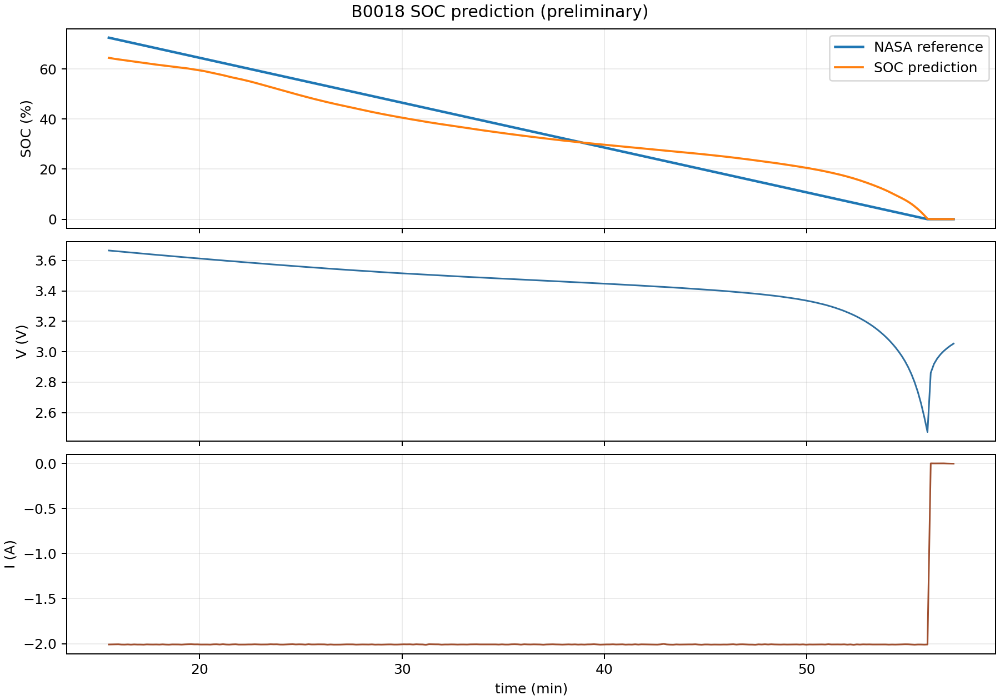

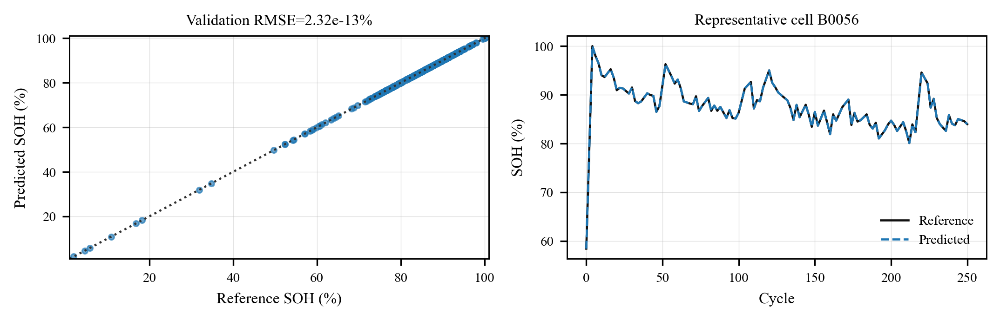

### 5.2 世界模型与安全层结果

Mamba 世界模型在 B0018 holdout 上取得 1-step 电压 MAE 1.42 mV，20-step open-loop rollout 电压 MAE 8.04 mV，满足单体世界模型电压预测目标。ECM 安全层通过与 MATLAB 二阶 RC 参考公式的交叉检查，最大误差小于 1 mV；随机 1000 条动作投影后均满足端电压边界。

| 指标 | 结果 |
|---|---:|
| B0018 1-step V MAE | 1.42 mV |
| B0018 20-step rollout V MAE | 8.04 mV |
| B0018 20-step rollout V p95 | 22.03 mV |
| ECM 随机动作投影通过率 | 100% |

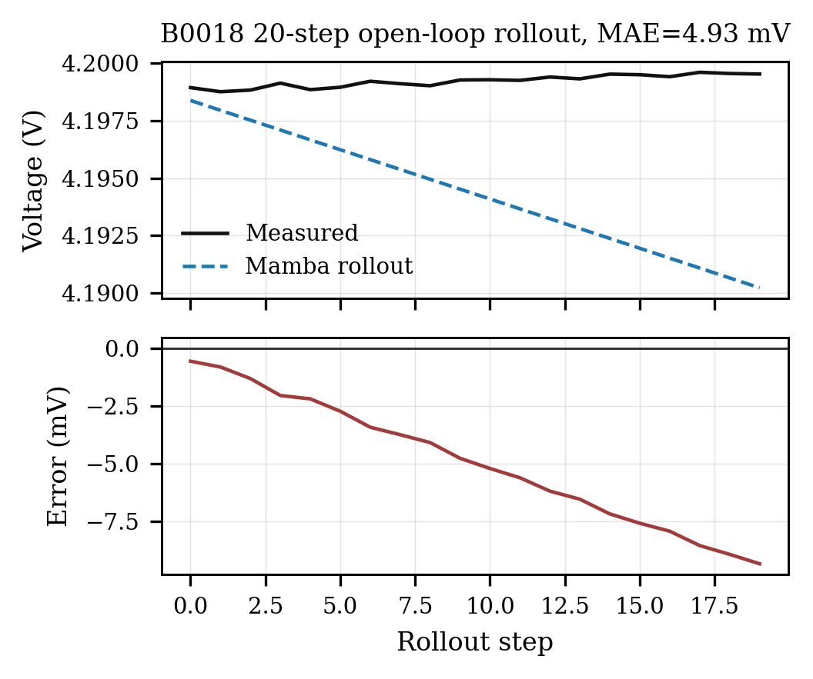

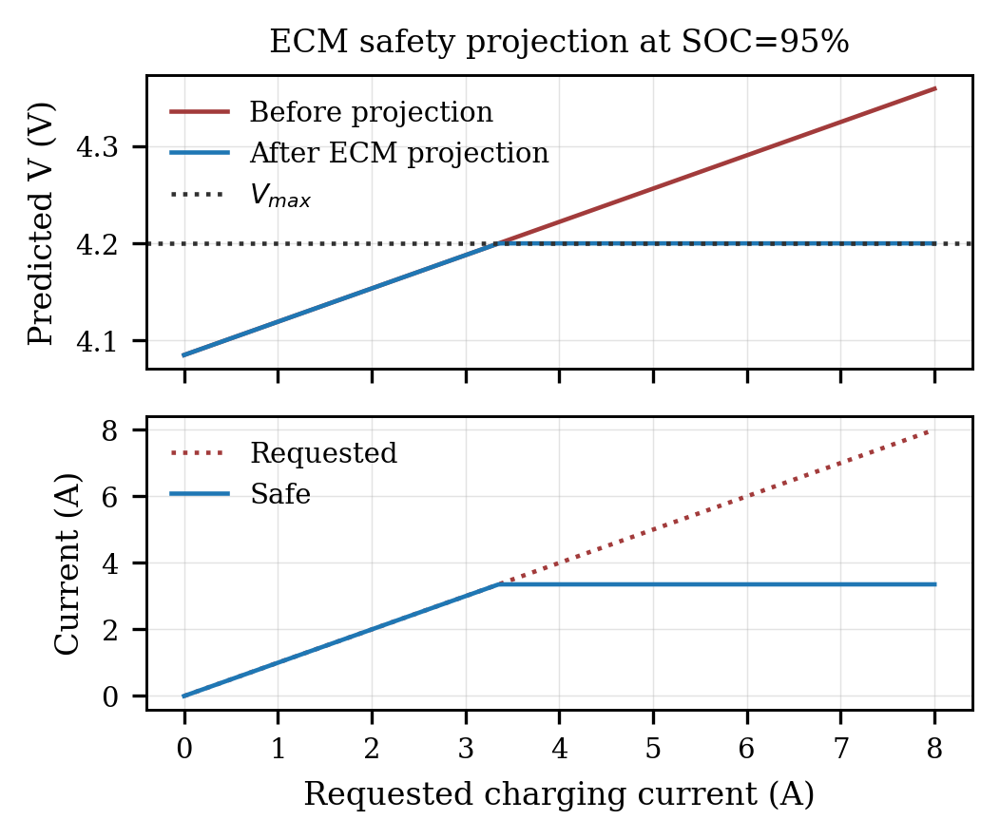

动态负载 Randomized 子集的记录需要复核：`SYSTEM_STATUS.md` 记录 sampled 20-step rollout V MAE 约 7.71 mV，但当前 `outputs/world_model_randomized_subset_eval.metrics.json` 中 one-step V MAE 为 2.39 mV、20-step rollout V MAE 为 26.88 mV。正式论文中建议只先写 one-step 结果，20-step 动态负载指标待重新跑一次后再定稿。

### 5.3 单体快充策略对比

W4 正式评估使用 SAC policy `outputs/sac_policy.zip`、3A CC-CV baseline、800-step horizon。在 paired episodes 上，SAC 相比 CC-CV 显著缩短充电时间，并降低单循环 SOH 损耗，且无实际过压。

| 指标 | CC-CV | SAC | 改善 |
|---|---:|---:|---:|
| 充至 80% 时间 | 596.5 s | 411.75 s | +30.97% |
| ΔSOH 单循环 | 0.001859 | 0.001536 | -17.37% |
| 过压次数 | 0 | 0 | 持平 |

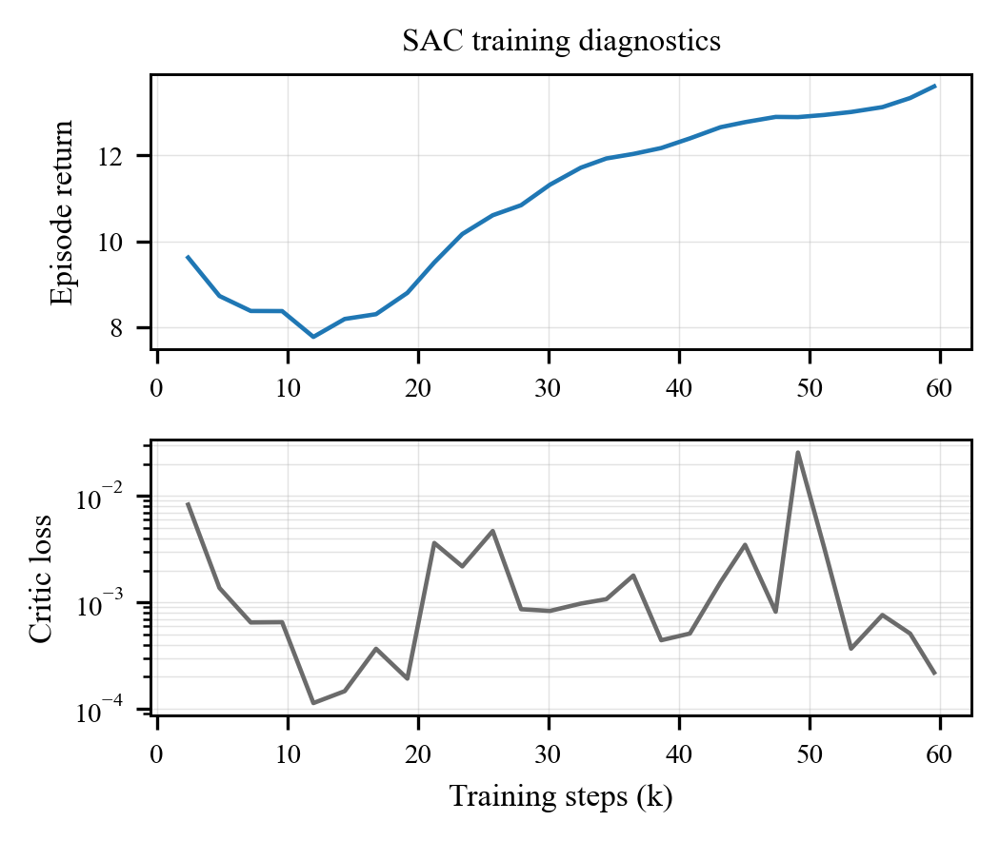

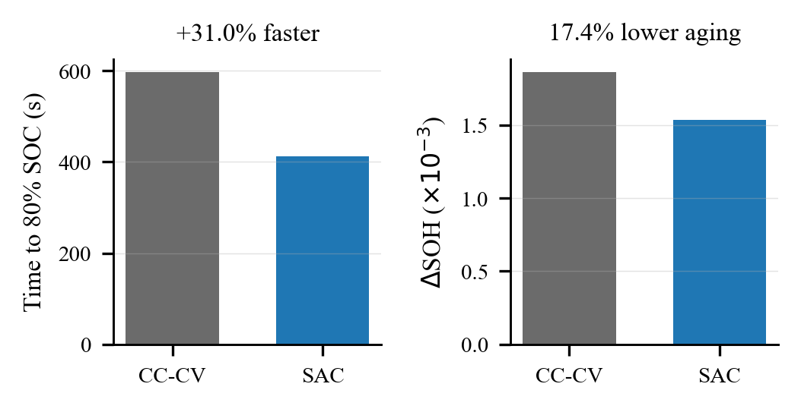

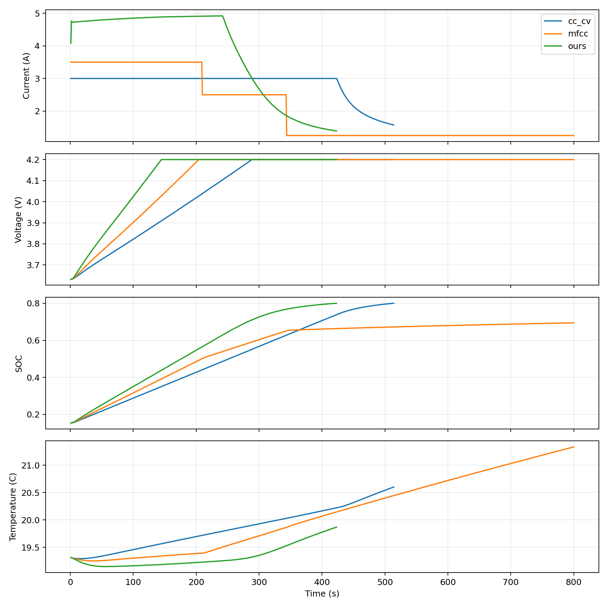

该结果满足 W4 核心目标：充电速度提升 ≥ 15%、ΔSOH 降低 ≥ 10%、过压 = 0。

### 5.4 包级策略复制结果

6S1P 包级原型采用更严格的停止口径：pack 内最低 SOC cell 达到 80%。在 3 个 episode 中，SAC hit_rate 为 3/3，CC-CV 为 1/3，MFCC 为 0/3。

| 指标 | CC-CV | MFCC | SAC |
|---|---:|---:|---:|
| hit_rate | 1/3 | 0/3 | 3/3 |
| 平均到目标时间 | 1121 s | NaN | 699.67 s |
| 平均 ΔSOH | 0.003147 | 0.003252 | 0.002513 |
| 末端 SOC spread | 0.02016 | 0.03787 | 0.02496 |
| 实际过压次数 | 0 | 0 | 0 |

在双方都命中的 paired episode 上，SAC 相比 CC-CV 将 pack min-cell 到 80% 的时间从 1121 s 降至 668 s，平均 ΔSOH 降低 23.01%，末端 SOC spread 降低 28.00%。

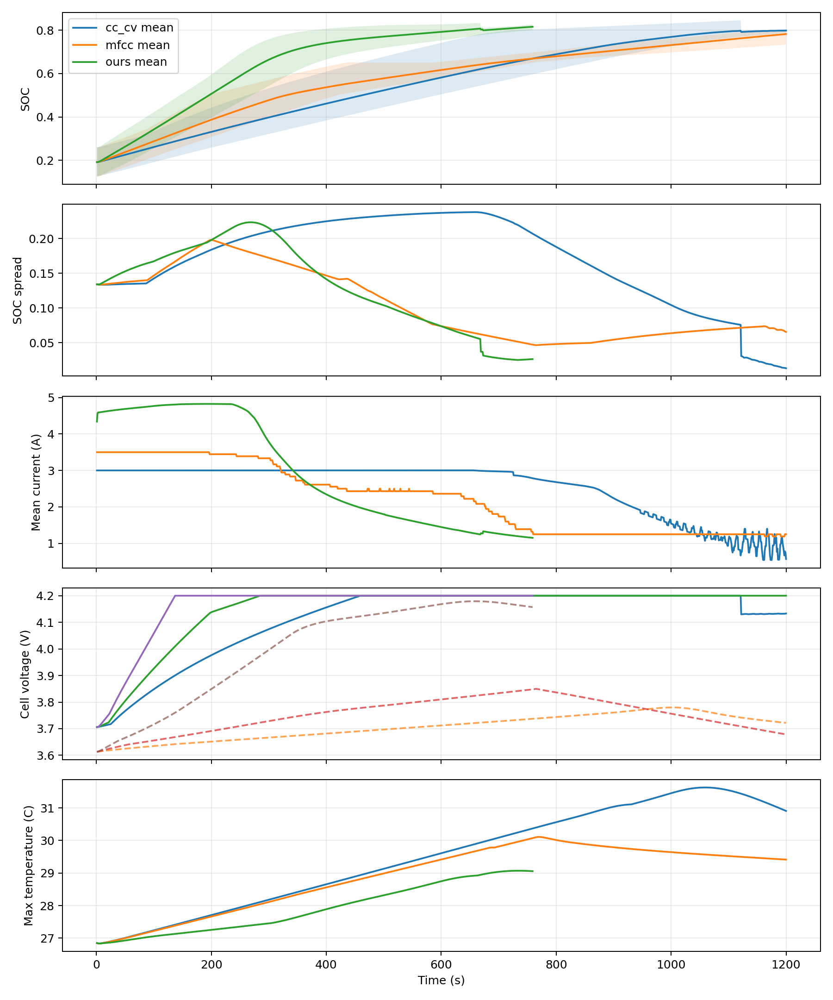

### 5.5 UPC 真实包级数据与主动均衡短仿真

UPC 36-cell pack 数据集为 12S3P 结构，包含 36 个单体电压、3 个支路电流、72 个单体表面温度、BMS SOC 和 balancing semicycle 标记。全量 summary 覆盖 410 个 Parquet cycle，其中 295 个 WLTP cycle，115 个 capacity check cycle，3 个 cycle 含 balancing semicycle。

以 Cycle 003 WLTP 为例，实测 cell voltage spread 均值为 244.56 mV，P95 为 510.00 mV，最大值为 590.00 mV，说明真实动态负载下 pack 内部不一致性显著。以含 balancing semicycle 的 Cycle 027 为例，balancing 段内 spread 起点为 308.00 mV，最小值为 127.00 mV，最大值为 622.00 mV，终点为 308.00 mV。真实 BMS balancing semicycle 不保证 spread 单调下降，spread 会受支路电流、测试阶段切换与 BMS 控制逻辑共同影响。

在 Python active buck-boost 短仿真中，本文从 UPC 高 spread 样本初始化，设置最大均衡电流 0.80 A。30 min 内，balancing off 的 spread 保持 622.00 mV，而 active buck-boost 将终点 spread 降至 334.00 mV，降幅 46.30%。

| Case | 初始 spread | 终点 spread | 降幅 | 最大均衡电流 |
|---|---:|---:|---:|---:|
| balancing off | 622.00 mV | 622.00 mV | 0.00% | 0.00 A |
| active buck-boost | 622.00 mV | 334.00 mV | 46.30% | 0.80 A |

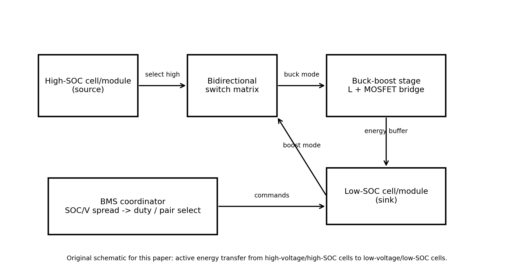

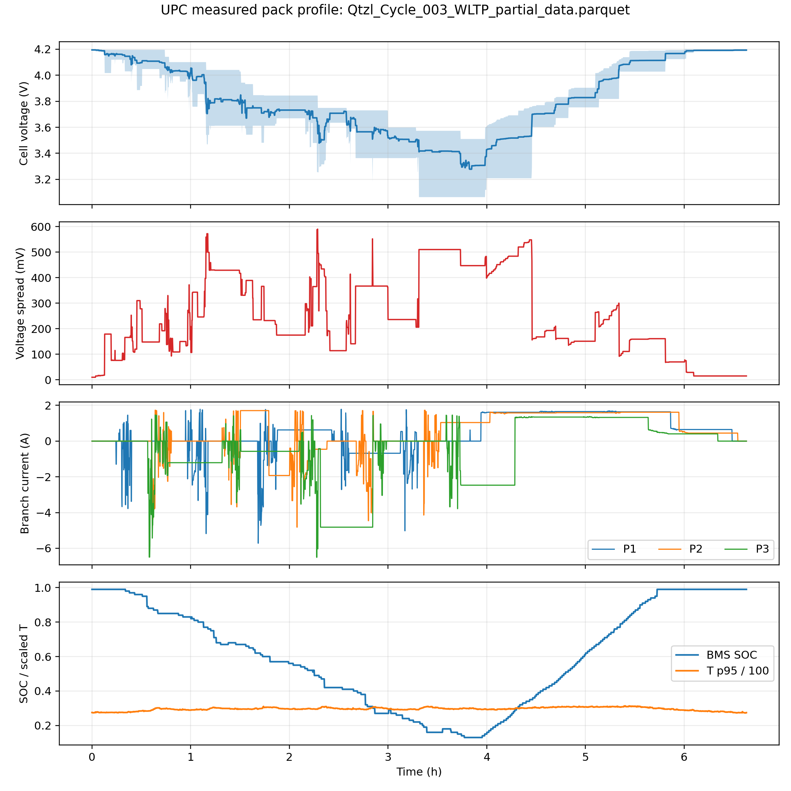

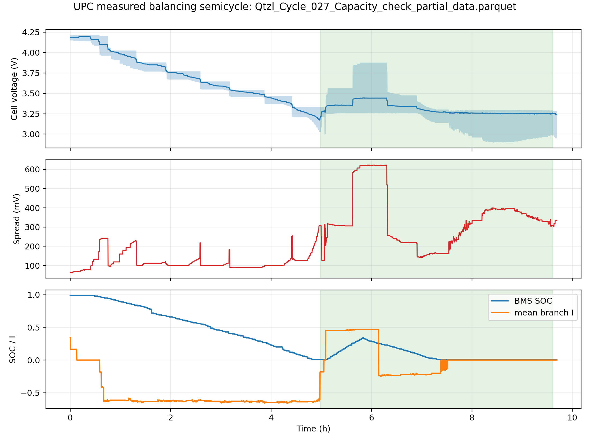

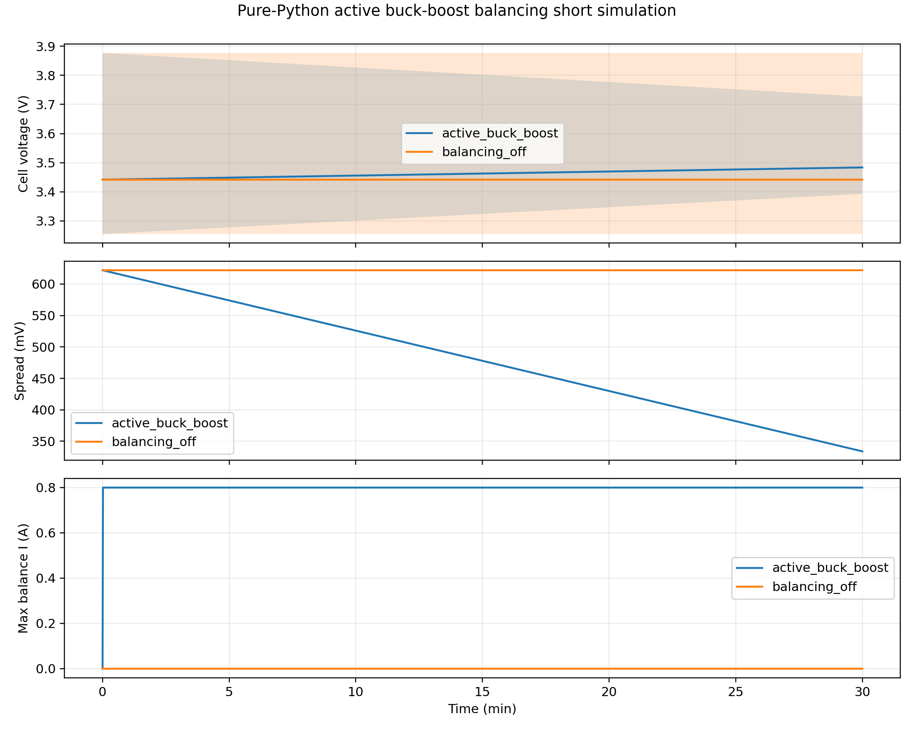

### 5.6 跨数据集泛化与真实电站定性展示

为检验当前系统在 NASA 主线之外的行为，本文补充两个不进入训练管线的展示实验。第一个是 Zenodo 6985321 fresh/aged cell 数据。该数据包含 99 h fresh cell、85 h aged cell 实验、OCV-SOC 表和论文配套 Matlab 脚本。本文按配套脚本口径进行库仑积分与端点电压锚定，重建 SOC 参考，并用 W1 SOC LSTM 进行 zero-shot 推断。

结果显示，fresh cell SOC MAE 为 16.11%，aged cell SOC MAE 为 14.03%。该误差显著高于 NASA 内部 B0018 holdout 的 3.48%，说明 20 Ah 级 cell、工况协议和电流尺度与 NASA 18650 主线差异较大，当前 W1 模型尚不能直接跨尺度部署。另一方面，用端点锚定半循环 throughput 估计 SOH 时，fresh cell 中位 SOH 为 98.02%，aged cell 中位 SOH 为 81.23%，与数据说明中的 aged reference 83.2% 接近。因此该实验适合作为“跨数据集诊断发现迁移瓶颈”的诚实结果，而不是泛化精度已达标的证据。

| 数据 | SOC MAE | SOC P95 | 半循环 SOH 中位数 | 说明 |
|---|---:|---:|---:|---|
| Zenodo 6985321 fresh | 16.11% | 35.13% | 98.02% | 20 Ah cell，fresh |
| Zenodo 6985321 aged | 14.03% | 34.01% | 81.23% | reference aged SOH 约 83.2% |

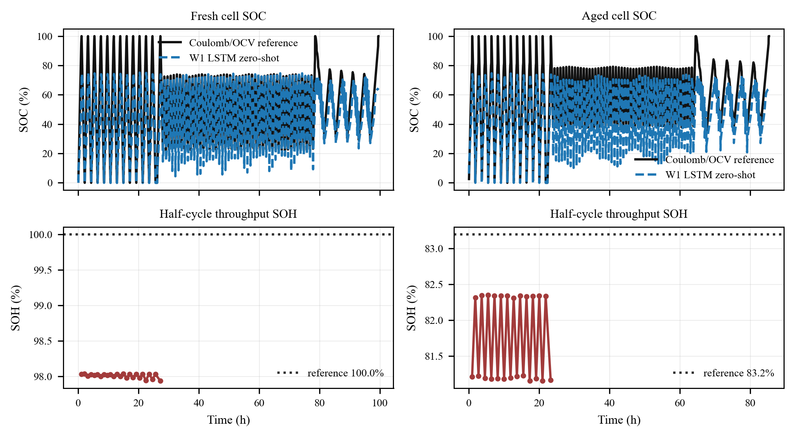

第二个是 Zenodo 18471156 真实储能电站数据。该数据按 CSV 组织，每段包含 8 个 cell 的电压、温度和 pack current，但不包含 SOC、SOH、容量或电池化学体系标签。本文下载并解压全量 `BatteryData.zip`，共得到 600 个 CSV 片段。图 16 自动选择电压 spread 较高的一段，展示 current、cell voltage envelope、temperature envelope，并用 W1 LSTM 输出定性 SOC 曲线。由于没有容量标签，图中灰色虚线为由 voltage spread 和 temperature spread 构造的 consistency proxy，不是定量 SOH。

选中片段为 `real_world_05_06/battery_03_cells_017-024_t_04000-07999.csv`，共 4000 行，电压 spread P95 为 21.00 mV，最大 spread 为 138.00 mV，电流绝对值 P95 为 135.70 A。该实验的意义在于证明数据接口和展示链路可落到真实工业监测格式上；后续若要定量评估，需要补充真实容量标定或站端 BMS SOC/SOH 标签。

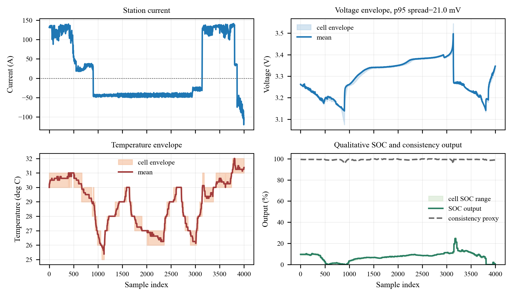

## 6. 讨论

### 6.1 速度、安全与老化的协同

实验结果表明，SAC 策略并非简单增大充电电流，而是在世界模型预测和 ECM 安全投影下寻找更合适的动态电流轨迹。相比 CC-CV，SAC 在 paired episodes 中同时提升速度并降低 ΔSOH，说明 reward 中显式老化项对策略形态产生了有效约束。

### 6.2 物理安全层的重要性

纯数据驱动策略在训练分布外容易产生不安全动作。本文将 ECM 作为 L3 安全层，确保每一步动作在执行前都满足端电压约束。这样即使世界模型或策略网络出现局部误差，最终输出仍经过物理投影，适合向 BMS 工程场景解释。

### 6.3 包级扩展的边界

当前包级原型是 Python supervisory simulator，并未求解真实 PWM / MOSFET / buck-boost 开关电路。它可以说明单体策略复制和主动均衡协调的控制逻辑，但不能替代 Simulink / Simscape 的电路级验证。后续若使用已有 Simulink 30 模组资产，应先完成数据回放校准、策略闭环仿真和 balancing on/off paired test，再将其作为论文图或答辩演示。

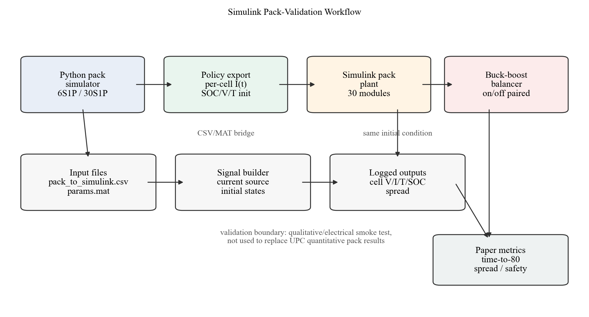

### 6.4 当前不足

当前版本仍存在以下不足：

1. SOC holdout MAE 为 3.48%，尚未达到 1.5% 目标。
2. Randomized 20-step 动态负载 rollout 指标存在记录差异，需要重新跑定稿指标。
3. SOH baseline 依赖容量字段，不代表无容量标签部署能力。
4. BatteryML Mamba-head SOH 对比尚未完成。
5. Zenodo 6985321 zero-shot SOC 误差较高，当前只能说明跨尺度迁移瓶颈，不能说明已具备跨数据集高精度泛化。
6. Zenodo 18471156 无 SOC/SOH/容量标签，因此只能做真实电站定性展示。
7. 包级主动均衡仍是数字孪生短仿真，不是开关级电路仿真。

## 7. 结论

本文实现了一套面向 EV 智能快充决策的端到端原型系统。系统以 NASA PCoE 同源数据为训练主线，融合 SOC/SOH 状态估计、Mamba 世界模型、SAC 连续控制策略和 ECM 物理安全层。单体实验显示，SAC 策略相较 CC-CV 可在无过压的前提下显著提升充电速度并降低单循环 SOH 损耗。包级实验进一步表明，单体策略可复制到多 cell pack，并通过 SOC-spread 均衡协调改善 pack 内一致性。UPC 真实 36-cell pack 数据分析和 active buck-boost 短仿真为包级扩展提供了公开数据支撑。

后续工作将集中在三方面：其一，补齐 SOC 精度与 Randomized 全量动态负载指标；其二，将 Zenodo 6985321 / 18471156 从展示性实验推进到有标签或可校准的泛化评估；其三，将 Python 包级策略轨迹接入可信 Simulink / Simscape pack plant，完成电路级均衡验证。

## 8. 图表索引

| 图号 | 内容 | 当前状态 | 建议路径 |
|---|---|---|---|
| 图 1 | 三层系统总体架构图 | 已生成 | `paper_figures/fig01_system_architecture.png` |
| 图 2 | NASA / UPC 数据流与训练划分 | 已生成 | `paper_figures/fig02_data_flow.png` |
| 图 3 | B0018 SOC 预测曲线 | 已汇总 | `paper_figures/fig08_soc_b0018_prediction.png` |
| 图 4 | SOH 预测 vs 真实 / 容量退化曲线 | 已生成 | `paper_figures/fig07_soh_baseline.png` |
| 图 5 | Mamba 世界模型预测 vs 真实 | 已生成 | `paper_figures/fig03_world_model_rollout.png` |
| 图 6 | ECM 安全动作投影示意 | 已生成 | `paper_figures/fig05_ecm_safety_projection.png` |
| 图 7 | SAC reward / training curve | 已生成 | `paper_figures/fig06_sac_training_curve.png` |
| 图 8 | 单体核心指标柱状图 | 已生成 | `paper_figures/fig04_w4_metrics_bar.png` |
| 图 9 | 单体 SAC vs CC-CV vs MFCC I/V/SOC/T | 已汇总 | `paper_figures/fig09_charging_comparison.png` |
| 图 10 | 6S1P pack 策略对比 | 已汇总 | `paper_figures/fig10_pack_comparison.png` |
| 图 11 | active buck-boost topology | 已汇总 | `paper_figures/fig11_active_balancer_topology.png` |
| 图 12 | UPC 实测 pack profile | 已汇总 | `paper_figures/fig12_upc_measured_profile.png` |
| 图 13 | UPC balancing semicycle | 已汇总 | `paper_figures/fig13_upc_real_balancing_semicycle.png` |
| 图 14 | active buck-boost 短仿真 | 已汇总 | `paper_figures/fig14_python_balancing_short_sim.png` |
| 图 15 | Zenodo 6985321 zero-shot SOC/SOH 曲线 | 已生成 | `paper_figures/zenodo_6985321/fig15_zenodo_6985321_zero_shot.png` |
| 图 16 | Zenodo 18471156 真实电站定性图 | 已生成 | `paper_figures/zenodo_18471156/fig16_zenodo_18471156_station_demo.png` |
| 图 17 | Simulink pack validation workflow | 已生成 | `paper_figures/fig17_simulink_pack_workflow.png` |

## 参考文献与数据来源

[1] NASA Prognostics Center of Excellence Data Set Repository. <https://www.nasa.gov/intelligent-systems-division/discovery-and-systems-health/pcoe/pcoe-data-set-repository/>  
[2] KeiLongW, battery-state-estimation. <https://github.com/KeiLongW/battery-state-estimation>  
[3] Microsoft BatteryML. <https://github.com/microsoft/BatteryML>  
[4] K. Liu et al., BatteryML: An Open-source platform for Machine Learning on Battery Degradation. <https://arxiv.org/abs/2310.14714>  
[5] A. Gu and T. Dao, Mamba: Linear-Time Sequence Modeling with Selective State Spaces. <https://arxiv.org/abs/2312.00752>  
[6] T. Haarnoja, A. Zhou, P. Abbeel, and S. Levine, Soft Actor-Critic: Off-Policy Maximum Entropy Deep Reinforcement Learning with a Stochastic Actor. <https://arxiv.org/abs/1801.01290>  
[7] UPC Lithium-ion battery pack cycling dataset with CC-CV charging and WLTP/constant discharge profiles. <https://doi.org/10.34810/data2395>  
[8] Scientific Data paper for UPC pack dataset. <https://www.nature.com/articles/s41597-025-06229-5>  
[9] MathWorks Battery Pack Cell Balancing. <https://www.mathworks.com/help/sps/ug/lithium-pack-cell-balancing.html>
[10] J. A. Braun et al., Code and measurement data - State of charge and state of health diagnosis of batteries with voltage-controlled models. Zenodo. <https://zenodo.org/records/6985321>  
[11] Energy Storage Power Station Lithium-Ion Battery Real-World Operation Dataset. Zenodo. <https://zenodo.org/records/18471156>
